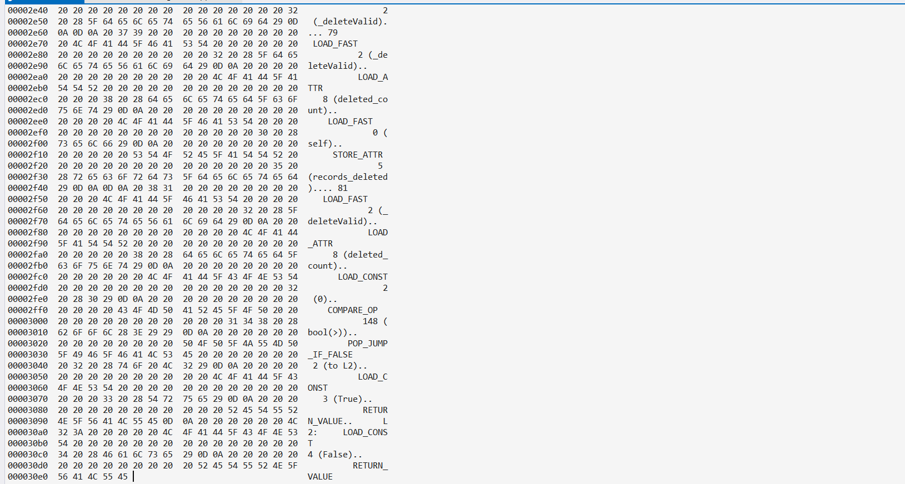

                ## **Artifact 1 Software Engineering and Design**

I decide to include this artifact because this class taught me about databases and most of the codes where written in python I know python because it was on the first languages I learned when I started college and even though I don’t use it as much anymore I wanted to show how im able to manage translating one coding language to another as well how I’m able to use reverse engineering by doing so it can show me any bugs or issues I can come across so I can better understand my program and what is asking the computer to do.
Skills im showing im able to understand multiple programing languages and most importantly use reverse engineering to find bugs and issues through my code. I feel like the way I improved the artifact is by finding bug and issues to make sure my program is secure and it can run smooth. What I learned while I was creating the artifact was the following, first I learned about the differences between libraries I needed in order to make the program work, as well C++ has more complex syntax rules. 
The main challenge was that when we created this project, we used the Apporto app which I no longer have access to, and we had all the tools there and the database where I could access everything really quick and easily however,
I no longer have access to it making it a little bit harder having to basically redo almost everything as well adding the libraries to the program before I didn’t have to download and add each of them through the package management now I have to do that to make the program work I had to add the mongo library etc.

Here is a small code snippet where i translated the code from python to C++.

```
class AnimalShelter {
public:
    int records_updated = 0;
    int records_matched = 0;
    int records_deleted = 0;
    
    AnimalShelter(string password, string userName = "merlina2000") {
        string encodedUserName = uriEncode(userName);
        string encodedPassword = uriEncode(password);
        string connectionString = "mongodb://" + encodedUserName + ":" + encodedPassword + "@localhost:32256/?authSource=AAC2";
        client = new MongoClient(connectionString);
        dataBase = client->getDatabase("AAC2");
    }
    
    bool createRecord(Document data) {
        if (!data.isEmpty()) {
            auto result = dataBase->getCollection("animals").insertOne(data);
            return result->acknowledged;
        } else {
            throw exception("No document to save. Data is empty.");
        }
    }

```

Here is a screenshot of the working O. file where i converted the file from C++ to O.



